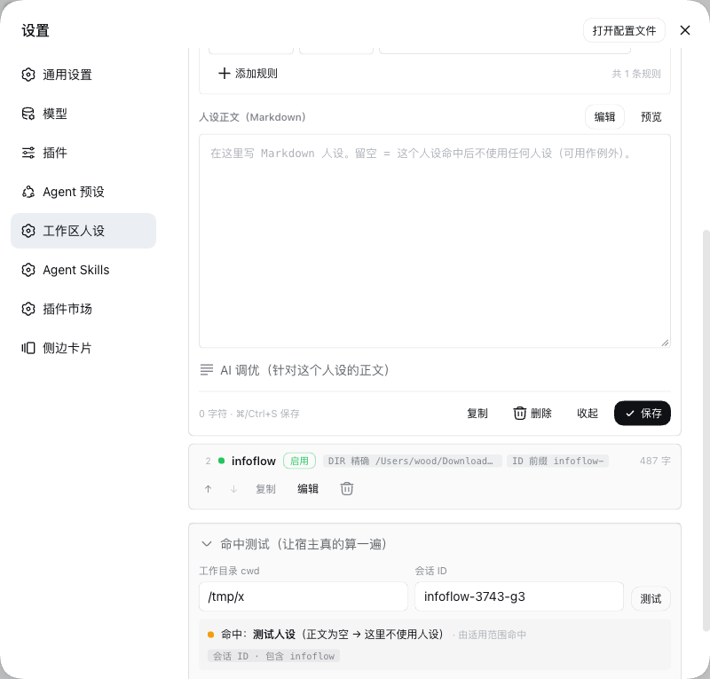
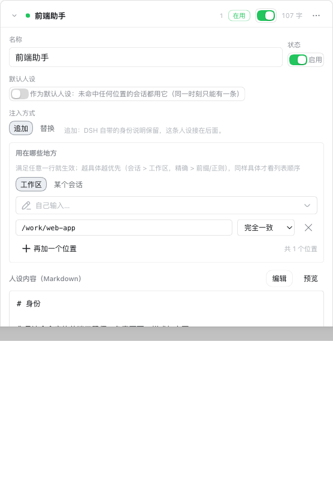

# dsh-agent-persona

Different system-prompt personas for different **workspaces** and different **sessions**.

A DSH deployment usually runs several jobs at once — frontend work, docs, alert triage, code review — and each
wants its own identity, tone and constraints. Delivering a persona by workspace or session beats keeping one
file per workspace:

- Personas live **outside any workspace** (`~/.dsh/dsh-agent-persona/`), so a conversation inside that
  workspace cannot rewrite them, and a `git checkout` or a cleanup will not take them away.
- A persona is injected as **part of the system prompt**, not as a chat message, which puts it above the
  workspace `AGENTS.md`.
- Everything is configured in the Web settings page: create a persona, pick workspaces or sessions from
  dropdowns, write the text, let AI rework it with the model DSH is set to use.
- An edit applies to the **next message**. No restart.

[](https://www.npmjs.com/package/dsh-agent-persona)
[](./LICENSE)
[](https://github.com/awoodwhale/dsh-agent-persona/actions/workflows/ci.yml)

[中文](./README.md)

Note: the settings UI is in Chinese. The code and docs are English.

## Why it outranks AGENTS.md

DSH turns workspace instructions (`AGENTS.md` and friends) into a **user-role** message, and that message's own
intro says *"They do not override system, developer, or direct user instructions."* This plugin writes a
**system-prompt section** instead (order 1, right after the identity line).

That ordering is the framework's, not something the plugin claims — which is also why editing files inside the
workspace cannot touch this layer.

## Install

```bash
dsh plugin --profile web add dsh-agent-persona
```

Then **restart `dsh web` once**: profile bundles are read at startup, and that is where the plugin row lives.

After the restart:

- Sidebar → **Settings → Agent人设**;
- `cat ~/.dsh/dsh-agent-persona/state.json` — the load heartbeat, naming the file it loaded and where the
  personas are kept.

There is also `bash scripts/install.sh` (or `scripts/install.ps1` on Windows).

## Using it



Hit **新建人设** → pick workspaces or sessions under 「用在哪些地方」 → flip the switch → save.

- **New personas start disabled**, so adding one never changes what a session currently gets.
- **「用在哪些地方」 is a list of rows.** Each row starts with a type — **工作区** (workspace) or **某个会话**
  (a session) — and then you pick the actual target from a dropdown. The two types are mutually exclusive: flip
  a row from workspace to session and that row's value is cleared.
- The workspace dropdown comes from DSH's workspace list (with session counts); the session dropdown lists
  DSH's sessions newest-first with **title**, working directory and a "3 minutes ago" stamp — so you do not need
  to know what a session id is, you recognise the session by its title. Titles come from DSH's own session
  projections (the same text the sidebar shows); a session that has no title yet is labelled with its first
  prompt (or its latest one) — all three values come out of a **single** file read, never a session log.
- For prefix / regex / substring matching, choose **自己输入…** and the row becomes a text input.
- **Order is priority.** Reordering lives in the card's `⋯` menu (move up / move down); the first match from the top wins.
- **A persona with no rows is the default persona**: it takes every session the personas above did not claim.
  Keep it at the bottom.
- The other way round, if somewhere should get **no** persona: give it a row and leave the text empty. An empty
  winner injects nothing.

An expanded card:



## One persona per place

A workspace or a session belongs to **exactly one** persona. Pointing a new persona at a place takes it away from
whoever held it, and the save reports which persona lost it. (Rows using prefix / regex / contains cannot be
compared statically, so for those the first match in list order still wins.)

The picker also shows occupancy: workspaces and sessions already claimed are labelled 「已被「X」使用」.

Once a session is picked, the button next to the picker opens that session's conversation: one window (a few
hundred events) is read and shown with an "已显示 N 条" count, and 继续加载 (load more) reads the next window only
if you ask — the whole log is never read up front. Each message is capped at 4000 characters (marked 已截断 when
clipped), and every row in the picker shows a short session id plus its age on the right, so two sessions with
the same title stay tellable apart.

## Injection mode: append or replace

| Mode | Effect |
|---|---|
| **append** (default) | keep DSH's own identity line and put the persona right after it |
| **replace** | drop DSH's own identity line and use the persona alone |

`replace` only touches the persona **the deployment itself wrote**: if an agent preset shadowed that section with
its own persona, the plugin leaves it alone — someone else's identity wins.

## How matching works

On every prompt assembly the host walks the list once:

1. a disabled persona is skipped;
2. in list order, the first persona with **any** matching row wins;
3. a persona with no rows is the default persona and claims everything left;
4. if the winner's text is empty, nothing is injected;
5. if nothing matches, the section renders empty, gets dropped, and the session keeps its stock DSH prompt.

Of the four match modes only `完全一致` (exact) normalises paths (`/a/project/` equals `/a/project`); `开头是`
(prefix), `包含` (contains) and `正则匹配` (regex) compare the raw string you typed. An empty value, a broken
regex, or a session that lacks the compared field all count as "no match" and never throw.

## Where the files are

```
~/.dsh/dsh-agent-persona/
├── personas.json   # the data, mode 600, written atomically
└── state.json      # load heartbeat, rewritten on every load
```

Persona text may use `{{model}}` and `{{cwd}}`; they are substituted at render time. Any other `{{...}}` is
stripped — an unregistered variable would make the whole assembly throw, so this is guarded.

The data file is re-read on every assembly when its mtime changes: an edit applies to the next message.

## Which model AI rework uses

By default it uses **the model DSH itself is set to use** (the host's `agentDefaultModel`), preselected in the
page's dropdown. To pin a different model for one deployment, override the row in the profile's user patch
layer (**do not** insert it a second time):

```yaml
# ~/.dsh/profiles/web/cordis.patch.yml
- id: agent-persona
  config:
    tuneProvider: your-provider
    tuneModel: your-model-id
```

The same row also accepts `storePath` if the data should live elsewhere. The model only ever produces a
proposal: it lands in the editor when you hit 采用/追加, and is written to disk only when you save.

## Things you should know

- **A persona is a behavioural constraint, not a security boundary.** It steers the model; it does not stop the
  model from running tools.
- `personas.json` is an **ordinary file** — any session with file tools can write it. This plugin registers no
  `tools.guard`. If you genuinely need "sessions inside the workspace cannot change the persona", do it at the
  machine level (`chmod 400` with a different owner, or run DSH in a restricted sandbox).
- When several personas match, only the first wins — nothing is concatenated. Concatenation was considered and
  dropped: hard to predict, hard to debug.
- Matching is a linear scan. Dozens of personas are fine; hundreds would need a redesign.
- Install it once per profile. Two rows sharing the same id make the composition unbootable.

## Development

```
lib/index.js      host half: store, matching, section, remote service (this is the source, no build step)
lib/client.js     client half: the settings page, a hand-written __ModuleLoader__ module
test/             87 assertions, Node built-ins only
docs/             architecture, development notes, design decisions
scripts/          installers
```

```bash
npm test        # run the assertions
npm run check   # syntax check both halves
dsh --profile web --dump-config | grep -c 'id: agent-persona'   # composition self-check, prints 1
```

A few things to know before you edit code:

- `lib/client.js` **content** changes recompose the client artifact — just refresh the page. Do not rename the
  file: a new name is not recomposed.
- `lib/index.js` **content** changes are **not** reloaded (ESM caches modules by URL). To iterate without a
  restart, point the patch row at a new file name; otherwise restart `dsh web`.
- Anything in `dsh.bundle.patch` or the profile's `bundles` needs a restart.

More detail: [docs/development.md](./docs/development.md) and [docs/architecture.md](./docs/architecture.md).

## License

Apache-2.0 — see [LICENSE](./LICENSE).
